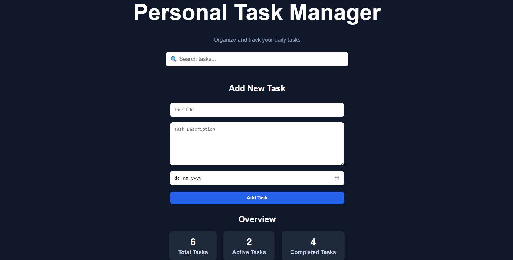
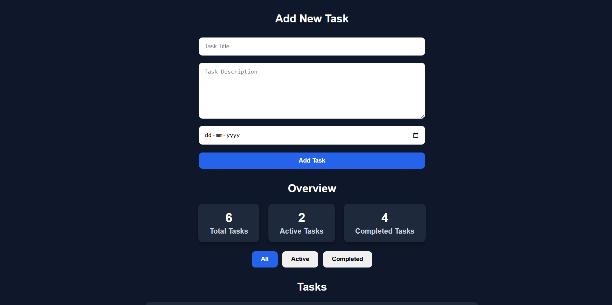
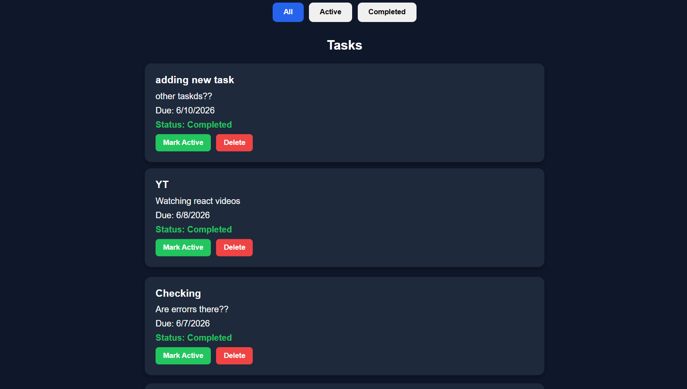

# Personal Task Manager

A full-stack task management application built using React, Node.js, Express.js, and SQLite. This project helps users organize their daily tasks efficiently with features like task creation, search, filtering, completion tracking, and task statistics.

## Live Demo

Frontend:
https://anshul-task-manager.vercel.app

Backend API:
https://personal-task-manager-api-xdwc.onrender.com
---

## Overview

Personal Task Manager is a responsive web application that allows users to manage tasks in a simple and organized way. Users can add new tasks, mark tasks as completed, search tasks instantly, filter tasks based on status, and monitor progress through task statistics.

---

## Features

- Create new tasks with title, description, and due date
- Mark tasks as Active or Completed
- Delete tasks with confirmation
- Search tasks by title
- Filter tasks by:
  - All Tasks
  - Active Tasks
  - Completed Tasks
- Task Statistics Dashboard
- Overdue Task Highlighting
- Responsive User Interface
- SQLite Database Integration

---
## Deployment

Frontend: Vercel
Backend: Render
Database: SQLite

## Screenshots

### Dashboard



### Adding New Task



### Search Functionality


### Task List



---

## Tech Stack

| Layer | Technology |
|---------|------------|
| Frontend | React.js, Axios, CSS |
| Backend | Node.js, Express.js |
| Database | SQLite |
| Version Control | Git & GitHub |

---

## Project Structure

```text
task-manager/
│
├── client/
│   ├── src/
│   │   ├── components/
│   │   │   ├── FilterBar.jsx
│   │   │   ├── SearchBar.jsx
│   │   │   ├── TaskForm.jsx
│   │   │   ├── TaskItem.jsx
│   │   │   ├── TaskList.jsx
│   │   │   └── TaskStats.jsx
│   │   │
│   │   ├── App.jsx
│   │   ├── App.css
│   │   └── index.css
│   │
│   └── package.json
│
├── server/
│   ├── controllers/
│   ├── routes/
│   ├── database/
│   ├── server.js
│   └── package.json
│
├── screenshots/
│   ├── dashboard.png
│   ├── adding_task.png
│   ├── search.png
│   └── tasklist.png
│
└── README.md
```

---

## Installation and Setup

### Prerequisites

Make sure you have installed:

- Node.js
- npm
- Git

---

https://anshul-task-manager.vercel.app/

### Clone Repository

```bash
git clone https://github.com/anshul200527/task-manager.git
cd task-manager
```

---

### Backend Setup

```bash
cd server

npm install

npm run dev
```

Backend will run on:

```text
http://localhost:5000
```

---

### Frontend Setup

Open a new terminal:

```bash
cd client

npm install

npm run dev
```

Frontend will run on:

```text
http://localhost:5173
```

---

## API Endpoints

### Get All Tasks

```http
GET /api/tasks
```

### Create Task

```http
POST /api/tasks
```

### Update Task

```http
PUT /api/tasks/:id
```

### Delete Task

```http
DELETE /api/tasks/:id
```

---

## Current Features Status

| Feature | Status |
|----------|----------|
| Create Tasks | Completed |
| Delete Tasks | Completed |
| Search Tasks | Completed |
| Filter Tasks | Completed |
| Task Statistics | Completed |
| Mark Complete / Active | Completed |
| Overdue Detection | Completed |

---

## Future Improvements

- Edit Task Functionality
- Task Priority Levels
- Task Categories
- User Authentication
- Dark / Light Theme Toggle
- Task Sorting Options
- Dashboard Analytics
- Current version uses a shared SQLite database.
- Authentication and user-specific task management are planned future enhancements.
---

## Author

**Anshul Bahuguna**

B.Tech Computer Science and Engineering  
Graphic Era Hill University

GitHub: https://github.com/anshul200527

---

## License

This project is developed for educational and learning purposes.

---

Built using React, Express.js and SQLite.